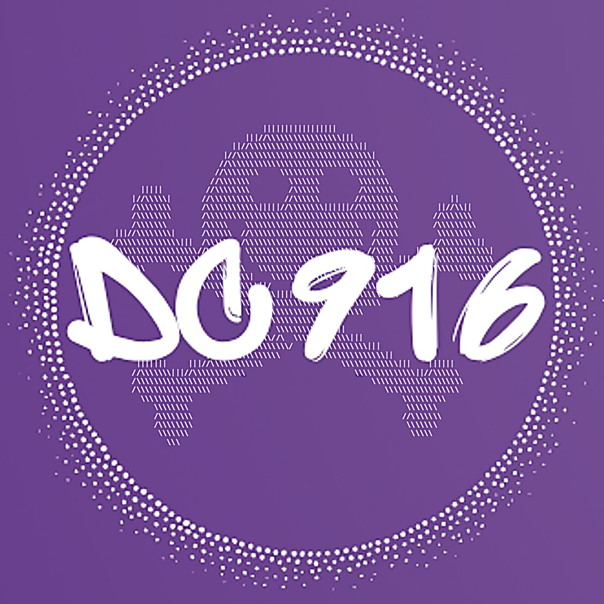

# Cybersecurity Sacramento (DC916) Website

<div align="center">
  
  <p><em>Belonging is the very best thing there is</em></p>
</div>

This repository contains the source code for the Cybersecurity Sacramento (DC916) website, a DEF CON group for hackers, makers, tinkerers, and security enthusiasts in the Sacramento area.

[](https://dc916.com)
[](https://pages.github.com/)
[](https://jekyllrb.com/)
[](LICENSE)

## 📖 Table of Contents

- [Overview](#-overview)
- [Features](#-features)
- [Site Structure](#-site-structure)
- [Documentation](#-documentation)
- [Installation & Setup](#-installation--setup)
- [Development Workflow](#-development-workflow)
- [Customization](#-customization)
- [Contributing](#-contributing)
- [License](#-license)
- [Contact](#-contact)

## 🔍 Overview

The DC916 website is built using Jekyll, a static site generator, and is hosted on GitHub Pages. It features a custom theme designed to mimic the PowerShell IDE with Sacramento Kings colors (purple and silver), creating a unique hacker aesthetic that represents our community.

The site serves as a central hub for our community, providing information about:
- Our mission and values
- Upcoming events and meetings
- Resources for cybersecurity enthusiasts
- Projects and initiatives
- Community leadership and contacts

## ✨ Features

- **Responsive Design**: Fully responsive layout that works seamlessly on mobile, tablet, and desktop devices
- **Terminal Aesthetic**: Custom theme with PowerShell blue background, Sacramento Kings purple accents, and terminal-like interface elements
- **Interactive Elements**:
  - Console typing effects with blinking cursor
  - Card-based layouts for projects and directory pages
  - Collapsible sections for resource pages
  - Modal dialogs for PDF resources
- **Resource Database**: Comprehensive collection of cybersecurity resources organized by category
- **Social Media Integration**: Links to our Discord, Twitter, and other social platforms
- **Custom 404 Page**: Themed error page that maintains the site's aesthetic

## 🗂 Site Structure

The site follows a standard Jekyll structure with some customizations:


### Key Files and Directories

- **`_config.yml`**: Jekyll configuration file
- **`_layouts/`**: Contains the default layout template
- **`_includes/`**: Contains partial templates like head-custom.html
- **`assets/`**: Contains CSS, JavaScript, and image files
  - **`css/style.scss`**: Main stylesheet with CSS variables for theming
  - **`js/console-effect.js`**: JavaScript for terminal typing effects
  - **`js/main.js`**: General JavaScript functionality
- **`resources/`**: Contains resource files and pages
  - **`pages/`**: Markdown files for each resource category
  - Various text and PDF files with resource content
- **Content Pages**: Markdown files for each page of the site
  - **`index.md`**: Home page
  - **`resources.md`**: Resources hub page
  - **`Directory.md`**: Community directory
  - **`Projects.md`**: Projects showcase
  - And others...
- **`_site/`**: Generated static site (not committed to repository)
- **`docs/`**: Documentation files for the project
  - **`INSTALLATION.md`**: Detailed installation instructions
  - **`CONTRIBUTING.md`**: Guidelines for contributing to the project
  - **`DEVELOPMENT.md`**: Development workflow and Jekyll features
  - **`SITE_STRUCTURE.md`**: Detailed site architecture explanation
  - **`TROUBLESHOOTING.md`**: Common issues and solutions

## 📚 Documentation

The project includes comprehensive documentation in the `docs/` directory:

- [Documentation Home](docs/index.md): Overview and navigation for all documentation
- [Installation Guide](docs/INSTALLATION.md): Detailed setup instructions for different operating systems
- [Contributing Guidelines](docs/CONTRIBUTING.md): How to contribute to the project
- [Development Guide](docs/DEVELOPMENT.md): Detailed information about development workflow and Jekyll features
- [Site Structure](docs/SITE_STRUCTURE.md): Detailed explanation of the site's architecture with diagrams
- [Troubleshooting](docs/TROUBLESHOOTING.md): Common issues and solutions

## 🚀 Installation & Setup

For detailed installation instructions, see [INSTALLATION.md](docs/INSTALLATION.md).

Quick start:

1. **Prerequisites**:
   - Ruby (version 2.5.0 or higher)
   - RubyGems
   - GCC and Make

2. **Install Jekyll and Bundler**:
   ```bash
   gem install jekyll bundler
   ```

3. **Clone the repository**:
   ```bash
   git clone https://github.com/CyberSecSacramento/Cybersecurity-Sacramento.git
   cd Cybersecurity-Sacramento
   ```

4. **Install dependencies**:
   ```bash
   bundle install
   ```

5. **Start the local server**:
   ```bash
   bundle exec jekyll serve
   ```

6. **View the site** at `http://localhost:4000`

## 🔄 Development Workflow


1. **Create a branch** for your changes:
   ```bash
   git checkout -b feature/your-feature-name
   ```

2. **Make your changes** to the site content or structure

3. **Preview your changes** locally:
   ```bash
   bundle exec jekyll serve
   ```

4. **Commit your changes**:
   ```bash
   git add .
   git commit -m "Description of changes"
   ```

5. **Push to GitHub**:
   ```bash
   git push origin feature/your-feature-name
   ```

6. **Create a Pull Request** for review

## 🎨 Customization

The site uses CSS variables for easy color customization. The main variables are defined at the top of `assets/css/style.scss`:

```css
:root {
  --powershell-blue: #012456;
  --kings-purple: #5B2B82;
  --kings-silver: #C4CED4;
  --conifer: #b5e853;
  --terminal-text: #E0E0E0;
  --terminal-background: #012456;
  --terminal-border: #444;
  /* ... other variables ... */
}
```

### Adding New Pages

1. Create a new Markdown file in the root directory
2. Add front matter at the top:
   ```yaml
   ---
   layout: default
   title: Your Page Title
   ---
   ```
3. Add your content using Markdown
4. Link to your page from other pages as needed

### Adding Resources

1. Create a new Markdown file in the `resources/pages/` directory
2. Add front matter at the top:
   ```yaml
   ---
   layout: default
   title: Resource Category Name
   ---
   ```
3. Add your content using Markdown
4. Update the `resources.md` file to include a link to your new resource category

## 👥 Contributing

Contributions are welcome! Here's how you can contribute:

1. **Fork the repository**
2. **Create a feature branch**:
   ```bash
   git checkout -b feature/your-feature-name
   ```
3. **Make your changes**
4. **Commit your changes**:
   ```bash
   git commit -m "Add some feature"
   ```
5. **Push to the branch**:
   ```bash
   git push origin feature/your-feature-name
   ```
6. **Open a Pull Request**

Please ensure your code follows the existing style and structure.

## 📄 License

This project is open source and available under the [MIT License](LICENSE).

## 📞 Contact

For questions or more information about DC916, please reach out to:

- **Discord**: [Join our Discord server](https://discord.gg/dc916)
- **Twitter**: [@DC916](https://twitter.com/DC916)
- **Email**: [info@dc916.com](mailto:info@dc916.com)

---

<div align="center">
  <p>Made with ❤️ by the DC916 community</p>
</div>
