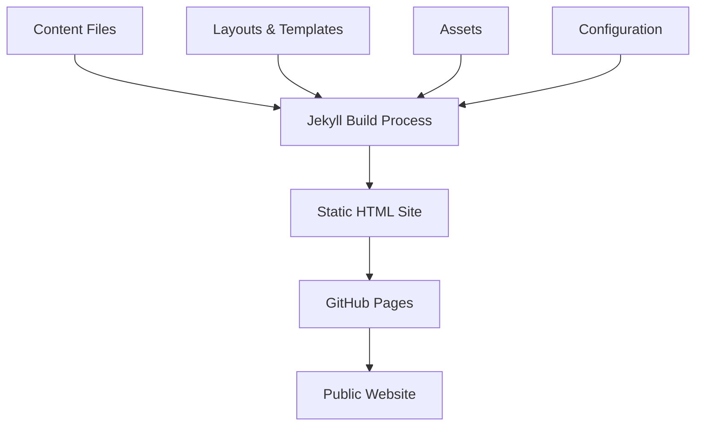
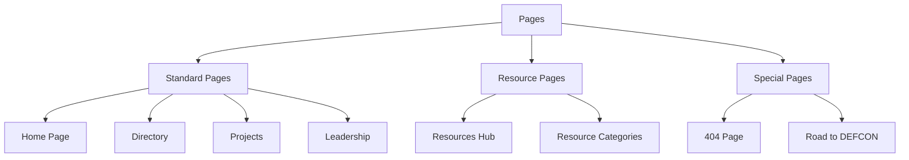
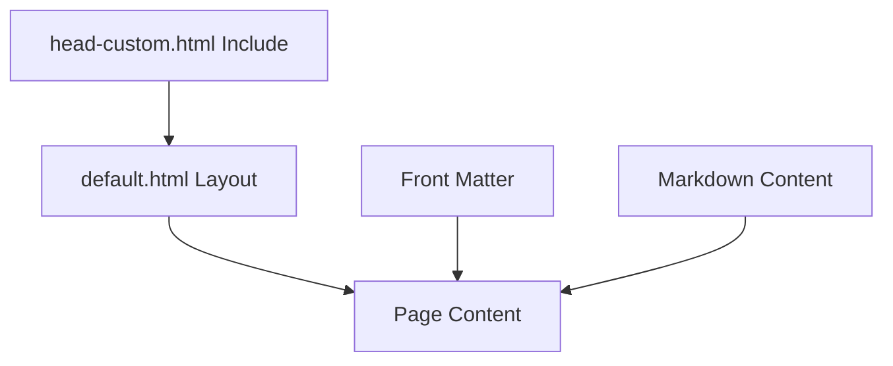
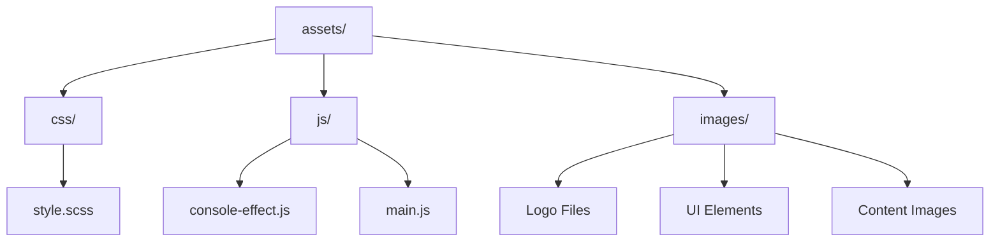
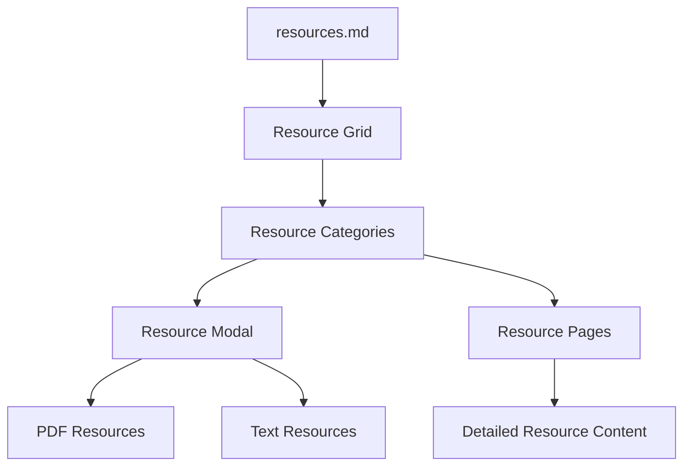
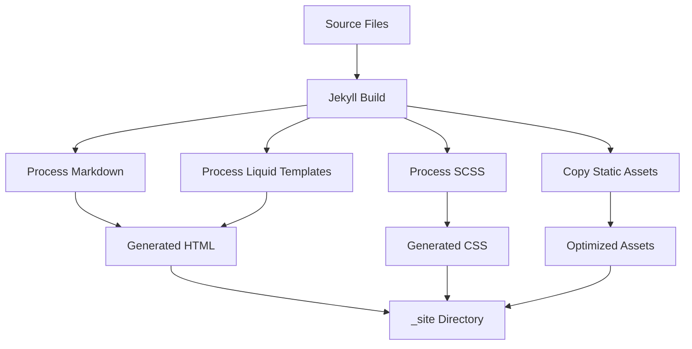
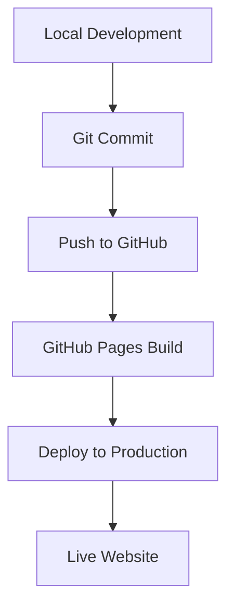

# DC916 Website Structure

This document provides a detailed overview of the DC916 website's architecture, explaining how different components interact and how the site is organized.

## Table of Contents

- [Overall Architecture](#overall-architecture)
- [Directory Structure](#directory-structure)
- [Page Types](#page-types)
- [Template System](#template-system)
- [Asset Organization](#asset-organization)
- [Resource System](#resource-system)
- [Build Process](#build-process)
- [Deployment Flow](#deployment-flow)

## Overall Architecture

The DC916 website is built using Jekyll, a static site generator. The site follows a component-based architecture where content is separated from presentation:



The key components are:

1. **Content Files**: Markdown files with YAML front matter
2. **Layouts & Templates**: HTML templates that define the structure
3. **Assets**: CSS, JavaScript, and images
4. **Configuration**: Jekyll configuration in `_config.yml`
5. **Build Process**: Jekyll transforms the content into a static site
6. **Deployment**: GitHub Pages hosts the static site

## Directory Structure

The site follows this directory structure:

```
Cybersecurity-Sacramento/
├── _config.yml              # Jekyll configuration
├── _includes/               # Reusable HTML components
│   └── head-custom.html     # Custom head content
├── _layouts/                # Page templates
│   └── default.html         # Main layout template
├── _site/                   # Generated site (not in repo)
├── assets/                  # Static assets
│   ├── css/                 # Stylesheets
│   │   └── style.scss       # Main stylesheet
│   ├── js/                  # JavaScript files
│   │   ├── console-effect.js # Terminal typing effect
│   │   └── main.js          # Main JavaScript functionality
│   └── images/              # Image files
├── resources/               # Resource files
│   ├── pages/               # Resource category pages
│   └── [resource files]     # Various resource files
└── [content pages].md       # Markdown content pages
```

### Key Files and Their Purposes

- **`_config.yml`**: Defines site-wide settings, collections, and plugins
- **`_layouts/default.html`**: The main template that wraps all pages
- **`_includes/head-custom.html`**: Custom content for the `<head>` section
- **`assets/css/style.scss`**: Main stylesheet with CSS variables and styles
- **`assets/js/console-effect.js`**: JavaScript for terminal typing effects
- **`assets/js/main.js`**: General JavaScript functionality
- **`index.md`**: The home page content
- **`resources.md`**: The resources hub page
- **`resources/pages/*.md`**: Individual resource category pages

## Page Types

The site includes several types of pages:



### Standard Pages

Standard pages use the default layout and contain general content:

- **Home Page (`index.md`)**: Introduction to DC916
- **Directory (`Directory.md`)**: Community directory
- **Projects (`Projects.md`)**: Projects showcase
- **Leadership (`Leadership.md`)**: Team information
- **Code of Conduct (`CoC.md`)**: Community guidelines
- **Donations (`Donations.md`)**: Donation information
- **Giveaways (`Giveaways.md`)**: Giveaway information

### Resource Pages

Resource pages are part of the resources system:

- **Resources Hub (`resources.md`)**: Main entry point for resources
- **Resource Categories (`resources/pages/*.md`)**: Individual resource categories

### Special Pages

Special pages have unique functionality:

- **404 Page (`404.md`)**: Custom error page
- **Road to DEFCON (`road-to-defcon.md`)**: Special event page

## Template System

The template system uses Jekyll's layouts and includes:



### Layout Structure

The `default.html` layout defines the overall page structure:

```html
<!DOCTYPE html>
<html lang="en">
<head>
  <!-- Meta tags, title, CSS -->
  
</head>
<body>
  <header>
    <!-- Navigation -->
  </header>
  
  <main>
    {{ content }}
  </main>
  
  <footer>
    <!-- Footer content -->
  </footer>
  
  <!-- JavaScript -->
</body>
</html>
```

### Content Integration

Content files use front matter to specify the layout and other metadata:

```yaml
---
layout: default
title: Page Title
---

# Markdown Content

Page content goes here...
```

## Asset Organization

Assets are organized by type:



### CSS Architecture

The CSS follows a component-based architecture:

```
style.scss
├── Variables
├── Reset
├── Base Styles
├── Layout
├── Components
│   ├── Header
│   ├── Navigation
│   ├── Terminal
│   ├── Cards
│   ├── Resources
│   └── Footer
└── Utilities
```

### JavaScript Organization

JavaScript is organized by functionality:

- **`console-effect.js`**: Terminal typing effect
- **`main.js`**: General site functionality, including:
  - Modal dialogs
  - Resource loading
  - Interactive elements

## Resource System

The resource system is organized into categories:



### Resource Flow

When a user interacts with resources:

1. User visits the resources hub (`resources.md`)
2. User clicks on a resource category
3. For PDF resources:
   - A modal opens with a link to the PDF
4. For text resources:
   - User is directed to the resource category page
   - The page displays detailed information about the resource

## Build Process

The Jekyll build process transforms the source files into a static site:



### Build Steps

1. **Process Markdown**: Convert Markdown to HTML
2. **Process Liquid Templates**: Apply layouts and includes
3. **Process SCSS**: Compile SCSS to CSS
4. **Copy Static Assets**: Copy images and JavaScript
5. **Generate Site**: Output to `_site` directory

## Deployment Flow

The site is deployed using GitHub Pages:



### Deployment Steps

1. **Local Development**: Make changes locally
2. **Git Commit**: Commit changes to Git
3. **Push to GitHub**: Push to the GitHub repository
4. **GitHub Pages Build**: GitHub Pages builds the site
5. **Deploy to Production**: Site is deployed to production
6. **Live Website**: Site is available at dc916.com

---

This document provides a comprehensive overview of the DC916 website structure. For more detailed information about specific components, refer to the other documentation files:

- [README.md](../README.md): General overview
- [INSTALLATION.md](INSTALLATION.md): Installation instructions
- [DEVELOPMENT.md](DEVELOPMENT.md): Development guide
- [CONTRIBUTING.md](CONTRIBUTING.md): Contribution guidelines
- [TROUBLESHOOTING.md](TROUBLESHOOTING.md): Common issues and solutions
