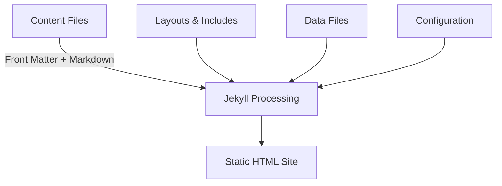

# Development Guide for DC916 Website

This guide provides detailed information for developers working on the DC916 website. It covers Jekyll features, advanced customization options, and best practices for development.

## Table of Contents

- [Jekyll Overview](#jekyll-overview)
- [Project Structure](#project-structure)
- [Liquid Templating](#liquid-templating)
- [Front Matter](#front-matter)
- [Working with Layouts](#working-with-layouts)
- [CSS/SCSS Architecture](#cssscss-architecture)
- [JavaScript Features](#javascript-features)
- [Adding New Pages](#adding-new-pages)
- [Working with Resources](#working-with-resources)
- [Performance Optimization](#performance-optimization)
- [SEO Considerations](#seo-considerations)
- [Accessibility](#accessibility)
- [Advanced Jekyll Features](#advanced-jekyll-features)

## Jekyll Overview

Jekyll is a static site generator that transforms plain text into static websites. It's built with Ruby and uses the following core concepts:



Key Jekyll features used in this project:

- **Markdown content** with YAML front matter
- **Liquid templating** for dynamic content
- **Layouts** for consistent page structure
- **Includes** for reusable components
- **SCSS processing** for stylesheets
- **Collections** for organizing related content

## Project Structure

The DC916 website follows this structure:

```
Cybersecurity-Sacramento/
├── _config.yml              # Jekyll configuration
├── _includes/               # Reusable HTML components
│   └── head-custom.html     # Custom head content
├── _layouts/                # Page templates
│   └── default.html         # Main layout template
├── _site/                   # Generated site (not in repo)
├── assets/                  # Static assets
│   ├── css/                 # Stylesheets
│   │   └── style.scss       # Main stylesheet
│   ├── js/                  # JavaScript files
│   │   ├── console-effect.js # Terminal typing effect
│   │   └── main.js          # Main JavaScript functionality
│   └── images/              # Image files
├── resources/               # Resource files
│   ├── pages/               # Resource category pages
│   └── [resource files]     # Various resource files
└── [content pages].md       # Markdown content pages
```

## Liquid Templating

Jekyll uses Liquid templating for dynamic content. Here are the key Liquid features used in this project:

### Objects

Objects represent variables that output content:

```liquid
{{ page.title }}
{{ site.data.members }}
{{ site.time | date_to_string }}
```

### Tags

Tags create logic and control flow:

```liquid

  <div class="sidebar">Sidebar content</div>



  <a href="{{ item.link }}">{{ item.name }}</a>



```

### Filters

Filters modify the output of objects:

```liquid
{{ "hello world" | capitalize }}
{{ page.content | number_of_words }}
{{ site.posts | where: "category", "cybersecurity" }}
```

## Front Matter

Front matter is YAML at the beginning of content files that defines variables for the page:

```yaml
---
layout: default
title: My Page Title
permalink: /custom-url/
featured_image: /assets/images/featured.jpg
show_sidebar: true
custom_css:
  - custom1
  - custom2
---
```

Common front matter variables in this project:

- `layout`: Specifies which layout to use
- `title`: Page title
- `permalink`: Custom URL for the page
- `description`: Page description for SEO
- `custom_css`: Additional CSS files to include
- `custom_js`: Additional JavaScript files to include

## Working with Layouts

Layouts define the structure of pages. The main layout is in `_layouts/default.html`.

To create a new layout:

1. Create a new HTML file in the `_layouts` directory
2. Use Liquid to include dynamic content:

```html
<!DOCTYPE html>
<html lang="en">
<head>
  <meta charset="UTF-8">
  <title>{{ page.title }} | {{ site.title }}</title>
  <!-- Include styles and scripts -->
</head>
<body>
  <header>
    
  </header>
  
  <main>
    {{ content }}
  </main>
  
  <footer>
    
  </footer>
</body>
</html>
```

3. Use the layout in content files:

```yaml
---
layout: your-new-layout
---
```

## CSS/SCSS Architecture

The site uses SCSS for styling, with a focus on variables for theming:

### CSS Variables

The main variables are defined in `assets/css/style.scss`:

```scss
:root {
  --powershell-blue: #012456;
  --kings-purple: #5B2B82;
  --kings-silver: #C4CED4;
  --conifer: #b5e853;
  --terminal-text: #E0E0E0;
  --terminal-background: #012456;
  --terminal-border: #444;
  /* ... other variables ... */
}
```

### CSS Organization

The CSS follows this organization:

1. **Variables**: Color and theme definitions
2. **Reset**: Basic reset and normalization
3. **Base**: Typography and base element styles
4. **Layout**: Container and grid styles
5. **Components**: Specific UI component styles
6. **Utilities**: Helper classes

### Adding Custom CSS

To add custom CSS for a specific page:

1. Create a new SCSS file in `assets/css/`
2. Import it in `style.scss` or include it via front matter:

```yaml
---
custom_css: your-custom-file
---
```

## JavaScript Features

The site uses vanilla JavaScript for interactive features:

### Console Typing Effect

The console typing effect is implemented in `assets/js/console-effect.js`. It simulates terminal typing with a blinking cursor.

### Modal Dialogs

Modal dialogs for resources are implemented in `assets/js/main.js`.

### Adding Custom JavaScript

To add custom JavaScript:

1. Create a new JS file in `assets/js/`
2. Include it in the layout or via front matter:

```yaml
---
custom_js: your-custom-file
---
```

## Adding New Pages

To add a new page to the site:

1. Create a new Markdown file in the root directory
2. Add front matter:

```yaml
---
layout: default
title: Your Page Title
permalink: /your-page-url/
---
```

3. Add your content using Markdown
4. Link to your page from other pages as needed

## Working with Resources

The resources section is organized into categories:

### Resource Categories

Each resource category has:

1. A Markdown file in `resources/pages/`
2. Content files in `resources/`
3. An entry in the resources grid in `resources.md`

### Adding a New Resource Category

To add a new resource category:

1. Create a new Markdown file in `resources/pages/`
2. Add any resource files to `resources/`
3. Update the resource grid in `resources.md` to include your new category

## Performance Optimization

To optimize the site's performance:

### Image Optimization

- Compress images using tools like ImageOptim
- Use appropriate image formats (JPEG for photos, PNG for graphics with transparency, SVG for icons)
- Specify image dimensions in HTML

### CSS/JS Optimization

- Minimize CSS and JavaScript files
- Use async or defer for non-critical scripts
- Consider lazy-loading for non-critical resources

### Jekyll Optimization

- Use Jekyll's incremental build feature during development:
  ```bash
  bundle exec jekyll serve --incremental
  ```
- Consider using Jekyll's caching options in `_config.yml`

## SEO Considerations

The site uses the `jekyll-seo-tag` plugin for basic SEO. To optimize a page for search engines:

1. Use descriptive titles and headings
2. Add meta descriptions in front matter:
   ```yaml
   ---
   description: A detailed description of the page content
   ---
   ```
3. Use semantic HTML
4. Ensure images have alt text
5. Create a sitemap.xml file

## Accessibility

To ensure the site is accessible:

1. Use semantic HTML elements
2. Provide alternative text for images
3. Ensure sufficient color contrast
4. Make sure interactive elements are keyboard accessible
5. Test with screen readers
6. Follow WCAG 2.1 guidelines

## Advanced Jekyll Features

### Collections

Collections group related content. To create a new collection:

1. Define it in `_config.yml`:
   ```yaml
   collections:
     your_collection:
       output: true
       permalink: /your-collection/:path/
   ```

2. Create a directory `_your_collection/`
3. Add content files to the directory

### Data Files

Data files store structured data. To use data files:

1. Create a YAML, JSON, or CSV file in the `_data` directory
2. Access the data in templates:
   ```liquid
   
     {{ item.name }}
   
   ```

### Custom Plugins

To create a custom plugin:

1. Create a Ruby file in the `_plugins` directory
2. Define your plugin functionality
3. Note that custom plugins won't work on GitHub Pages unless you use GitHub Actions

---

This development guide covers the main aspects of working with the DC916 website. For more information about Jekyll, refer to the [official Jekyll documentation](https://jekyllrb.com/docs/).
