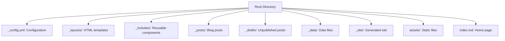

# Installation Guide for DC916 Website

This guide provides detailed instructions for setting up and running the DC916 website locally on your machine. Follow these steps to get the development environment up and running.

## Table of Contents

- [Prerequisites](#prerequisites)
  - [Windows](#windows)
  - [macOS](#macos)
  - [Linux](#linux)
- [Installation Steps](#installation-steps)
- [Running the Website](#running-the-website)
- [Common Issues & Troubleshooting](#common-issues--troubleshooting)
- [Development Tips](#development-tips)

## Prerequisites

Before you begin, you'll need to install the following software:

### Windows

1. **Install Ruby+Devkit**:
   - Download the Ruby+Devkit installer from [RubyInstaller](https://rubyinstaller.org/downloads/)
   - Choose a version >= 2.5.0 (recommended: 3.0.x or newer)
   - During installation, select "Add Ruby executables to your PATH" and "Associate .rb and .rbw files with Ruby"
   - At the end of the installation, run the `ridk install` step and select option 3

2. **Verify Installation**:
   ```
   ruby -v
   gem -v
   ```

### macOS

1. **Install Homebrew** (if not already installed):
   ```bash
   /bin/bash -c "$(curl -fsSL https://raw.githubusercontent.com/Homebrew/install/HEAD/install.sh)"
   ```

2. **Install Ruby**:
   ```bash
   brew install ruby
   ```

3. **Add Ruby to your PATH**:
   - For Zsh (default in macOS Catalina and newer):
     ```bash
     echo 'export PATH="/usr/local/opt/ruby/bin:$PATH"' >> ~/.zshrc
     source ~/.zshrc
     ```
   - For Bash:
     ```bash
     echo 'export PATH="/usr/local/opt/ruby/bin:$PATH"' >> ~/.bash_profile
     source ~/.bash_profile
     ```

4. **Verify Installation**:
   ```bash
   ruby -v
   gem -v
   ```

### Linux

1. **Install Ruby and development dependencies**:
   - For Ubuntu/Debian:
     ```bash
     sudo apt-get update
     sudo apt-get install ruby-full build-essential zlib1g-dev
     ```
   - For Fedora/CentOS/RHEL:
     ```bash
     sudo dnf install ruby ruby-devel make gcc gcc-c++ zlib-devel
     ```

2. **Configure Gem installation path**:
   ```bash
   echo '# Install Ruby Gems to ~/gems' >> ~/.bashrc
   echo 'export GEM_HOME="$HOME/gems"' >> ~/.bashrc
   echo 'export PATH="$HOME/gems/bin:$PATH"' >> ~/.bashrc
   source ~/.bashrc
   ```

3. **Verify Installation**:
   ```bash
   ruby -v
   gem -v
   ```

## Installation Steps

Once you have Ruby installed, follow these steps to set up the DC916 website:

1. **Install Jekyll and Bundler**:
   ```bash
   gem install jekyll bundler
   ```

2. **Clone the repository**:
   ```bash
   git clone https://github.com/CyberSecSacramento/Cybersecurity-Sacramento.git
   cd Cybersecurity-Sacramento
   ```

3. **Install dependencies**:
   - If a Gemfile exists:
     ```bash
     bundle install
     ```
   - If no Gemfile exists, create one:
     ```bash
     echo "source 'https://rubygems.org'" > Gemfile
     echo "gem 'jekyll'" >> Gemfile
     echo "gem 'jekyll-seo-tag'" >> Gemfile
     bundle install
     ```

## Running the Website

After installation, you can run the website locally:

1. **Start the Jekyll server**:
   ```bash
   bundle exec jekyll serve
   ```

2. **View the website** in your browser at `http://localhost:4000`

3. **Live reload** (optional):
   - To enable automatic page refresh when files are modified:
     ```bash
     bundle exec jekyll serve --livereload
     ```

4. **Build for production** (optional):
   - To generate the static site without starting a server:
     ```bash
     bundle exec jekyll build
     ```
   - The generated site will be in the `_site` directory

## Common Issues & Troubleshooting

### Ruby Version Issues

**Problem**: Jekyll requires Ruby version 2.5.0 or higher.
**Solution**: Check your Ruby version with `ruby -v` and upgrade if necessary.

### Permission Errors

**Problem**: "Permission denied" errors when installing gems.
**Solution**: 
- On Unix-based systems, use `sudo gem install jekyll bundler`
- Alternatively, set up a user-level gem installation directory as shown in the Linux instructions

### Dependency Conflicts

**Problem**: Bundler reports conflicts between dependencies.
**Solution**: 
```bash
bundle update
bundle install
```

### Port Already in Use

**Problem**: "Address already in use - bind(2) for 127.0.0.1:4000" error.
**Solution**: 
- Kill the process using the port: `lsof -i :4000` then `kill -9 [PID]`
- Or use a different port: `bundle exec jekyll serve --port 4001`

### SSL Certificate Issues

**Problem**: SSL certificate verification errors when installing gems.
**Solution**: 
```bash
gem sources -r https://rubygems.org/
gem sources -a http://rubygems.org/
```

## Development Tips

### Jekyll Commands

- **Create a new post**:
  ```bash
  bundle exec jekyll post "My New Post"
  ```

- **Create a new page**:
  ```bash
  bundle exec jekyll page "My New Page"
  ```

- **Build with drafts**:
  ```bash
  bundle exec jekyll serve --drafts
  ```

### Directory Structure

Understanding Jekyll's directory structure can help with development:



### Liquid Syntax

Jekyll uses Liquid templating language. Here are some common patterns:

- **Variables**: `{{ page.title }}`
- **Filters**: `{{ "hello" | capitalize }}`
- **Tags**: 
  ```
  
    <div class="sidebar">Sidebar content</div>
  
  ```
- **Loops**:
  ```
  
    <a href="{{ post.url }}">{{ post.title }}</a>
  
  ```

### Front Matter

Every content file should begin with front matter:

```yaml
---
layout: default
title: My Page
permalink: /my-page/
---
```

---

If you encounter any issues not covered in this guide, please [open an issue](https://github.com/CyberSecSacramento/Cybersecurity-Sacramento/issues) on the repository.
