# DC916 Website Documentation

Welcome to the documentation for the DC916 (Cybersecurity Sacramento) website. This documentation provides comprehensive information about the website's structure, development process, and guidelines for contributing.

## Available Documentation

| Document | Description |
|----------|-------------|
| [Installation Guide](INSTALLATION.md) | Detailed instructions for setting up the development environment on different operating systems |
| [Development Guide](DEVELOPMENT.md) | Information about Jekyll features, development workflow, and best practices |
| [GitHub Pages Deployment](GITHUB_PAGES.md) | Instructions for deploying the website to GitHub Pages |
| [Site Structure](SITE_STRUCTURE.md) | Detailed explanation of the website's architecture with diagrams |
| [Contributing Guidelines](CONTRIBUTING.md) | Guidelines for contributing to the project, including coding standards and pull request process |
| [Troubleshooting](TROUBLESHOOTING.md) | Solutions to common issues you might encounter |

## Quick Links

- [Project README](../README.md)
- [Code of Conduct](../CoC.md)
- [GitHub Repository](https://github.com/CyberSecSacramento/Cybersecurity-Sacramento)
- [Live Website](https://dc916.com)

## Getting Started

If you're new to the project, we recommend starting with the [Installation Guide](INSTALLATION.md) to set up your development environment, followed by the [Development Guide](DEVELOPMENT.md) to understand how the website is built.

If you're interested in contributing to the project, please read the [Contributing Guidelines](CONTRIBUTING.md) and the [Code of Conduct](../CoC.md).

## Documentation Structure

```mermaid
graph TD
    A[Documentation Home] --> B[Installation Guide]
    A --> C[Development Guide]
    A --> G[GitHub Pages Deployment]
    A --> D[Site Structure]
    A --> E[Contributing Guidelines]
    A --> F[Troubleshooting]
    
    B --> B1[Prerequisites]
    B --> B2[Installation Steps]
    B --> B3[Running the Website]
    
    C --> C1[Jekyll Overview]
    C --> C2[Project Structure]
    C --> C3[Templating & Styling]
    C --> C4[Advanced Features]
    
    G --> G1[Local vs GitHub Pages]
    G --> G2[Deployment Steps]
    G --> G3[Configuration]
    G --> G4[Troubleshooting]
    
    D --> D1[Overall Architecture]
    D --> D2[Directory Structure]
    D --> D3[Page Types]
    D --> D4[Asset Organization]
    
    E --> E1[Code of Conduct]
    E --> E2[Development Process]
    E --> E3[Coding Standards]
    E --> E4[Pull Request Process]
    
    F --> F1[Installation Issues]
    F --> F2[Build Issues]
    F --> F3[Development Issues]
    F --> F4[Deployment Issues]
```

## Feedback and Contributions

We welcome feedback and contributions to improve this documentation. If you find any issues or have suggestions for improvement, please [open an issue](https://github.com/CyberSecSacramento/Cybersecurity-Sacramento/issues) on GitHub or submit a pull request.

---

  
Made with ❤️ by the DC916 community

